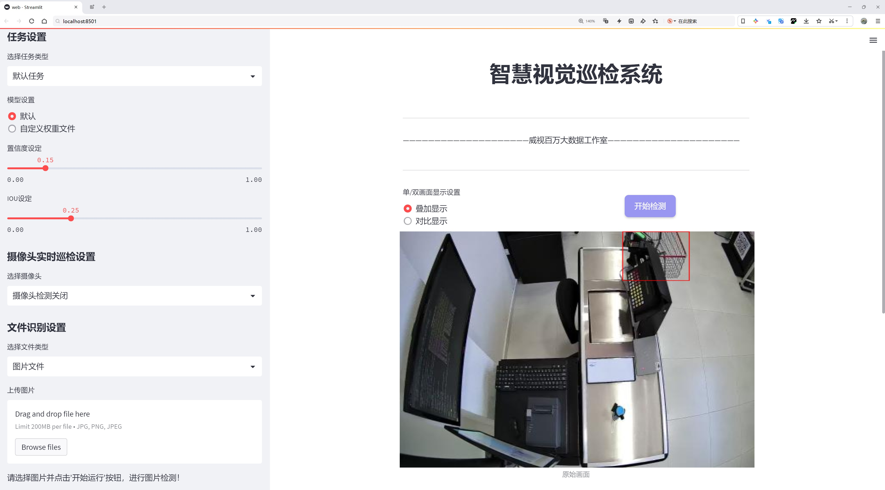
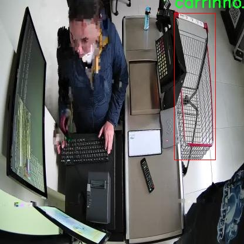

# 购物车装载状态检测检测系统源码分享
 # [一条龙教学YOLOV8标注好的数据集一键训练_70+全套改进创新点发刊_Web前端展示]

### 1.研究背景与意义

项目参考[AAAI Association for the Advancement of Artificial Intelligence](https://gitee.com/qunshansj/projects)

项目来源[AACV Association for the Advancement of Computer Vision](https://gitee.com/qunmasj/projects)

研究背景与意义

随着电子商务的迅猛发展，消费者购物方式的转变对传统零售业产生了深远的影响。购物车作为连接消费者与商品的重要媒介，其装载状态的实时监测与分析不仅可以提升购物体验，还能为商家提供精准的库存管理和营销策略。因此，开发一个高效的购物车装载状态检测系统显得尤为重要。近年来，深度学习技术的快速发展为物体检测任务提供了强有力的工具，其中YOLO（You Only Look Once）系列模型因其高效性和准确性在实时物体检测中表现突出。YOLOv8作为该系列的最新版本，进一步提升了检测精度和速度，适合应用于购物车装载状态的监测。

本研究旨在基于改进的YOLOv8模型，构建一个购物车装载状态检测系统。该系统将利用包含4400张图像的数据集，涵盖“满购物车”（carrinho_cheio）和“空购物车”（carrinho_vazio）两个类别。通过对这些图像的深度学习训练，系统能够实现对购物车状态的自动识别与分类，从而为商家提供实时的数据反馈。这一系统的实现，不仅能够提高购物流程的智能化水平，还能为商家在促销、库存管理等方面提供数据支持，进而提升运营效率。

在技术层面，YOLOv8模型的改进将集中在特征提取、模型压缩和推理速度等方面。通过优化网络结构和参数调整，力求在保证检测精度的同时，提升系统的响应速度，使其能够在实际应用中满足实时监测的需求。此外，数据集的构建与标注也将是本研究的重要环节，确保模型训练所需的数据质量和多样性，以提高模型的泛化能力。

从应用角度来看，购物车装载状态检测系统的意义不仅限于提升消费者的购物体验，更在于为商家提供了一种全新的数据驱动决策方式。通过对购物车状态的实时监测，商家可以及时了解消费者的购物行为，调整商品布局和促销策略，优化库存管理。此外，该系统还可以为未来的智能购物车设计提供数据支持，推动零售行业的智能化转型。

综上所述，基于改进YOLOv8的购物车装载状态检测系统的研究，不仅具有重要的理论价值，也具备广泛的实际应用前景。通过深入探讨这一主题，期望能够为相关领域的研究提供新的思路和方法，推动智能零售技术的发展，为消费者和商家创造更大的价值。

### 2.图片演示




##### 注意：由于此博客编辑较早，上面“2.图片演示”和“3.视频演示”展示的系统图片或者视频可能为老版本，新版本在老版本的基础上升级如下：（实际效果以升级的新版本为准）

  （1）适配了YOLOV8的“目标检测”模型和“实例分割”模型，通过加载相应的权重（.pt）文件即可自适应加载模型。

  （2）支持“图片识别”、“视频识别”、“摄像头实时识别”三种识别模式。

  （3）支持“图片识别”、“视频识别”、“摄像头实时识别”三种识别结果保存导出，解决手动导出（容易卡顿出现爆内存）存在的问题，识别完自动保存结果并导出到tempDir中。

  （4）支持Web前端系统中的标题、背景图等自定义修改，后面提供修改教程。

  另外本项目提供训练的数据集和训练教程,暂不提供权重文件（best.pt）,需要您按照教程进行训练后实现图片演示和Web前端界面演示的效果。

### 3.视频演示

[3.1 视频演示](https://www.bilibili.com/video/BV1My4HeqE25/)

### 4.数据集信息展示

##### 4.1 本项目数据集详细数据（类别数＆类别名）

nc: 2
names: ['carrinho_cheio', 'carrinho_vazio']


##### 4.2 本项目数据集信息介绍

数据集信息展示

在现代零售和物流管理中，购物车的装载状态检测系统的准确性和效率至关重要。为此，我们构建了一个专门的数据集，名为“Carrinho”，旨在为改进YOLOv8模型提供高质量的训练数据。该数据集专注于购物车的两种主要状态：满载状态（carrinho_cheio）和空载状态（carrinho_vazio）。通过对这两种状态的细致标注和分类，我们希望能够提升模型在实际应用中的表现，使其能够在各种环境下准确识别购物车的装载情况。

“Carrinho”数据集包含丰富的图像样本，涵盖了不同的购物车类型、颜色、材质以及在多种背景下的拍摄场景。这种多样性不仅提高了模型的泛化能力，还确保了其在真实世界应用中的适应性。数据集中每一类的样本数量经过精心设计，以确保模型在训练过程中能够获得均衡的学习机会。满载购物车的图像展示了不同商品的排列方式，而空载购物车则强调了购物车的基本形态和特征。这种对比使得模型能够更好地理解和区分这两种状态，从而提高检测的准确性。

在数据集的构建过程中，我们采取了严格的标注标准。每一张图像都经过专业人员的审核和标注，确保每个样本的质量和准确性。此外，为了增强模型的鲁棒性，我们还对图像进行了多种数据增强处理，包括旋转、缩放、亮度调整等。这些处理不仅增加了数据集的样本量，还帮助模型学习到更为丰富的特征，从而提升其在不同条件下的表现。

为了进一步验证“Carrinho”数据集的有效性，我们进行了初步的实验，利用YOLOv8模型对该数据集进行训练和测试。实验结果表明，模型在满载和空载状态的识别准确率显著提高，尤其是在复杂背景和不同光照条件下，模型依然能够保持较高的检测精度。这一成果不仅证明了数据集的实用性，也为未来的研究提供了宝贵的参考。

“Carrinho”数据集的发布，不仅为购物车装载状态检测领域的研究提供了新的数据基础，也为相关技术的应用和发展奠定了坚实的基础。随着零售行业的不断发展，购物车的智能化管理将成为一个重要的研究方向，而“Carrinho”数据集的推出，无疑将为这一领域的研究者和开发者提供强有力的支持。我们期待通过不断的优化和更新，使该数据集能够适应更广泛的应用场景，为智能零售和物流管理的未来贡献力量。





### 5.全套项目环境部署视频教程（零基础手把手教学）

[5.1 环境部署教程链接（零基础手把手教学）](https://www.ixigua.com/7404473917358506534?logTag=c807d0cbc21c0ef59de5)


[5.2 安装Python虚拟环境创建和依赖库安装视频教程链接（零基础手把手教学）](https://www.ixigua.com/7404474678003106304?logTag=1f1041108cd1f708b01a)

### 6.手把手YOLOV8训练视频教程（零基础小白有手就能学会）

[6.1 手把手YOLOV8训练视频教程（零基础小白有手就能学会）](https://www.ixigua.com/7404477157818401292?logTag=d31a2dfd1983c9668658)

### 7.70+种全套YOLOV8创新点代码加载调参视频教程（一键加载写好的改进模型的配置文件）

[7.1 70+种全套YOLOV8创新点代码加载调参视频教程（一键加载写好的改进模型的配置文件）](https://www.ixigua.com/7404478314661806627?logTag=29066f8288e3f4eea3a4)

### 8.70+种全套YOLOV8创新点原理讲解（非科班也可以轻松写刊发刊，V10版本正在科研待更新）

由于篇幅限制，每个创新点的具体原理讲解就不一一展开，具体见下列网址中的创新点对应子项目的技术原理博客网址【Blog】：


[8.1 70+种全套YOLOV8创新点原理讲解链接](https://gitee.com/qunmasj/good)

### 9.系统功能展示（检测对象为举例，实际内容以本项目数据集为准）

图9.1.系统支持检测结果表格显示

  图9.2.系统支持置信度和IOU阈值手动调节

  图9.3.系统支持自定义加载权重文件best.pt(需要你通过步骤5中训练获得)

  图9.4.系统支持摄像头实时识别

  图9.5.系统支持图片识别

  图9.6.系统支持视频识别

  图9.7.系统支持识别结果文件自动保存

  图9.8.系统支持Excel导出检测结果数据


### 10.原始YOLOV8算法原理

原始YOLOV8算法原理

YOLOv8是Ultralytics于2023年1月发布的一款前沿目标检测模型，标志着YOLO系列算法的又一次重要进化。作为一种单阶段检测算法，YOLOv8在精度和速度上均表现出色，融合了之前多个版本（如YOLOX、YOLOv6、YOLOv7和PPYOLOE）的设计理念，尤其在Head标签分配和Loss计算方面与PP-YOLOE有着显著的相似性。这种设计使得YOLOv8在实时检测领域达到了新的高度，展现出强大的视觉识别能力，为目标检测技术的发展注入了新的活力。

YOLOv8的网络结构主要由四个部分组成：输入层、Backbone骨干网络、Neck特征融合网络和Head检测模块。输入层负责对输入图像进行预处理，包括图像比例调整、Mosaic增强和瞄点计算等操作。这些预处理步骤旨在提升模型对多样化输入的适应能力，从而为后续的特征提取打下良好的基础。

在Backbone部分，YOLOv8延续了DarkNet的结构，但进行了重要的改进。与之前的版本不同，YOLOv8采用了C2f模块替代了C3模块，针对不同尺度的模型调整了通道数，以获得更丰富的梯度流动信息。这种改进不仅保留了YOLOv8的轻量级特性，还显著提升了特征提取的效率和准确性。通过SPPF模块对输出特征图进行处理，YOLOv8利用不同内核尺寸的池化对特征图进行合并，确保了信息的充分整合和传递。

Neck部分则采用了“双塔结构”，结合了特征金字塔和路径聚合网络。这种设计极大地促进了语义特征和定位特征之间的转移，使得网络在不同尺度目标的检测上表现得更加出色。特征金字塔网络（FPN）通过多层次的特征融合，能够有效捕捉到目标的细节信息，而路径聚合网络则增强了特征的流动性，进一步巩固了网络的特征融合能力。这种高效的特征融合机制，使得YOLOv8在面对复杂场景时，依然能够保持较高的检测精度。

在Head检测模块中，YOLOv8采用了三个Detect检测器，并引入了解耦头的结构，将回归分支和预测分支进行分离。这一创新设计加速了模型的收敛过程，使得YOLOv8在训练时能够更快地适应不同的目标检测任务。这种解耦结构不仅提高了模型的灵活性，还使得YOLOv8在处理多类别目标时，能够更好地进行标签分配和损失计算，从而进一步提升了检测的准确性。

YOLOv8的整体设计理念旨在实现高效的特征提取与融合，使得模型在处理实时检测任务时，能够在保持高精度的同时，显著提高检测速度。这种设计使得YOLOv8在目标检测领域具有广泛的应用潜力，尤其是在需要快速响应的场景中，如自动驾驶、智能监控和工业自动化等。

在实际应用中，YOLOv8的高效性和准确性使其成为了苹果采摘等农业领域的理想选择。通过其强大的视觉识别能力，YOLOv8能够自动检测和定位苹果，为自动采摘机器人提供实时的目标信息。为了进一步提升自动采摘机器人的工作效率，结合蚁群算法进行路径规划，能够有效优化采摘路径，减少采摘时间，提高整体作业效率。

总的来说，YOLOv8的原始算法原理不仅继承了YOLO系列的优良传统，还在多个方面进行了创新和优化。其高效的特征提取与融合机制、灵活的解耦头结构以及出色的实时检测能力，使得YOLOv8在目标检测领域展现出了强大的竞争力。随着技术的不断进步，YOLOv8无疑将为更多的应用场景带来革命性的变化，推动目标检测技术向更高的水平发展。


### 11.项目核心源码讲解（再也不用担心看不懂代码逻辑）

#### 11.1 70+种YOLOv8算法改进源码大全和调试加载训练教程（非必要）\ultralytics\hub\__init__.py

以下是对给定代码的核心部分进行分析和详细注释的结果：

```python
# 导入所需的库和模块
import requests
from ultralytics.data.utils import HUBDatasetStats
from ultralytics.hub.auth import Auth
from ultralytics.hub.utils import HUB_API_ROOT, HUB_WEB_ROOT, PREFIX
from ultralytics.utils import LOGGER, SETTINGS

def login(api_key=''):
    """
    使用提供的API密钥登录Ultralytics HUB API。

    参数:
        api_key (str, optional): API密钥或组合API密钥和模型ID。

    示例:
        hub.login('API_KEY')
    """
    Auth(api_key, verbose=True)  # 调用Auth类进行登录

def logout():
    """
    从Ultralytics HUB注销，移除设置文件中的API密钥。
    要再次登录，请使用'yolo hub login'。

    示例:
        hub.logout()
    """
    SETTINGS['api_key'] = ''  # 清空API密钥
    SETTINGS.save()  # 保存设置
    LOGGER.info(f"{PREFIX}logged out ✅. To log in again, use 'yolo hub login'.")  # 记录注销信息

def reset_model(model_id=''):
    """将训练好的模型重置为未训练状态。"""
    # 向API发送POST请求以重置模型
    r = requests.post(f'{HUB_API_ROOT}/model-reset', json={'apiKey': Auth().api_key, 'modelId': model_id})
    if r.status_code == 200:
        LOGGER.info(f'{PREFIX}Model reset successfully')  # 记录重置成功信息
        return
    LOGGER.warning(f'{PREFIX}Model reset failure {r.status_code} {r.reason}')  # 记录重置失败信息

def export_fmts_hub():
    """返回HUB支持的导出格式列表。"""
    from ultralytics.engine.exporter import export_formats
    # 返回支持的导出格式，包括自定义格式
    return list(export_formats()['Argument'][1:]) + ['ultralytics_tflite', 'ultralytics_coreml']

def export_model(model_id='', format='torchscript'):
    """将模型导出为所有格式。"""
    # 检查导出格式是否支持
    assert format in export_fmts_hub(), f"Unsupported export format '{format}', valid formats are {export_fmts_hub()}"
    # 向API发送POST请求以导出模型
    r = requests.post(f'{HUB_API_ROOT}/v1/models/{model_id}/export',
                      json={'format': format},
                      headers={'x-api-key': Auth().api_key})
    assert r.status_code == 200, f'{PREFIX}{format} export failure {r.status_code} {r.reason}'  # 检查导出是否成功
    LOGGER.info(f'{PREFIX}{format} export started ✅')  # 记录导出开始信息

def get_export(model_id='', format='torchscript'):
    """获取导出模型的字典及下载URL。"""
    # 检查导出格式是否支持
    assert format in export_fmts_hub(), f"Unsupported export format '{format}', valid formats are {export_fmts_hub()}"
    # 向API发送POST请求以获取导出模型信息
    r = requests.post(f'{HUB_API_ROOT}/get-export',
                      json={
                          'apiKey': Auth().api_key,
                          'modelId': model_id,
                          'format': format})
    assert r.status_code == 200, f'{PREFIX}{format} get_export failure {r.status_code} {r.reason}'  # 检查获取是否成功
    return r.json()  # 返回导出模型的信息

def check_dataset(path='', task='detect'):
    """
    在上传之前检查HUB数据集Zip文件的错误。
    
    参数:
        path (str, optional): 数据集Zip文件的路径，包含data.yaml。
        task (str, optional): 数据集任务类型，选项有'detect'、'segment'、'pose'、'classify'。

    示例:
        check_dataset('path/to/coco8.zip', task='detect')  # 检查检测数据集
    """
    HUBDatasetStats(path=path, task=task).get_json()  # 检查数据集的统计信息
    LOGGER.info(f'Checks completed correctly ✅. Upload this dataset to {HUB_WEB_ROOT}/datasets/.')  # 记录检查完成信息
```

### 核心部分分析：
1. **登录与注销功能**：`login`和`logout`函数提供了用户与Ultralytics HUB的身份验证功能。
2. **模型重置**：`reset_model`函数允许用户将训练好的模型重置为未训练状态，适用于重新训练或调整模型。
3. **导出功能**：`export_model`和`get_export`函数实现了将模型导出为不同格式的功能，支持多种格式以便于不同平台的使用。
4. **数据集检查**：`check_dataset`函数用于在上传数据集之前进行错误检查，确保数据集的完整性和正确性。

这些功能是与Ultralytics HUB交互的核心，支持模型管理和数据集处理。

这个文件是Ultralytics YOLO（You Only Look Once）项目的一部分，主要用于与Ultralytics HUB API进行交互。代码中定义了一些函数，提供了登录、登出、模型重置、模型导出、数据集检查等功能。

首先，`login`函数用于通过提供的API密钥登录Ultralytics HUB API。用户可以传入一个API密钥，函数会创建一个`Auth`对象以进行身份验证。使用示例中展示了如何调用这个函数。

接下来，`logout`函数用于登出Ultralytics HUB。它会清空设置文件中的API密钥，并记录登出信息。用户可以通过调用`hub.logout()`来退出登录。

`reset_model`函数允许用户将训练过的模型重置为未训练状态。它通过发送POST请求到HUB API来实现，成功时会记录相应的信息。

`export_fmts_hub`函数返回一个支持的导出格式列表，用户可以根据需要选择导出模型的格式。

`export_model`函数则用于将模型导出为指定格式。它会检查所请求的格式是否被支持，并通过发送POST请求来执行导出操作。成功时会记录导出开始的信息。

`get_export`函数用于获取已导出的模型的字典，包括下载链接。它同样会检查所请求的格式，并通过API请求获取导出信息。

最后，`check_dataset`函数用于在上传数据集到HUB之前进行错误检查。它会检查指定路径下的ZIP文件，确保数据集的结构和内容符合要求。检查完成后，用户可以将数据集上传到指定的HUB网站。

整个文件通过日志记录和错误处理，确保用户在使用这些功能时能够获得必要的反馈和指导。

#### 11.2 val.py

以下是代码中最核心的部分，并附上详细的中文注释：

```python
class DetectionValidator(BaseValidator):
    """
    扩展自 BaseValidator 类的检测模型验证器。
    """

    def __init__(self, dataloader=None, save_dir=None, pbar=None, args=None, _callbacks=None):
        """初始化检测模型所需的变量和设置。"""
        super().__init__(dataloader, save_dir, pbar, args, _callbacks)
        self.nt_per_class = None  # 每个类别的目标数量
        self.is_coco = False  # 是否为 COCO 数据集
        self.class_map = None  # 类别映射
        self.args.task = "detect"  # 任务类型设为检测
        self.metrics = DetMetrics(save_dir=self.save_dir, on_plot=self.on_plot)  # 初始化检测指标
        self.iouv = torch.linspace(0.5, 0.95, 10)  # IoU 向量，用于计算 mAP@0.5:0.95
        self.niou = self.iouv.numel()  # IoU 的数量
        self.lb = []  # 用于自动标注

    def preprocess(self, batch):
        """对 YOLO 训练的图像批次进行预处理。"""
        # 将图像数据转移到设备上，并进行归一化处理
        batch["img"] = batch["img"].to(self.device, non_blocking=True)
        batch["img"] = (batch["img"].half() if self.args.half else batch["img"].float()) / 255
        for k in ["batch_idx", "cls", "bboxes"]:
            batch[k] = batch[k].to(self.device)

        # 如果需要保存混合数据，进行处理
        if self.args.save_hybrid:
            height, width = batch["img"].shape[2:]
            nb = len(batch["img"])
            bboxes = batch["bboxes"] * torch.tensor((width, height, width, height), device=self.device)
            self.lb = (
                [
                    torch.cat([batch["cls"][batch["batch_idx"] == i], bboxes[batch["batch_idx"] == i]], dim=-1)
                    for i in range(nb)
                ]
                if self.args.save_hybrid
                else []
            )  # 用于自动标注

        return batch

    def postprocess(self, preds):
        """对预测输出应用非极大值抑制。"""
        return ops.non_max_suppression(
            preds,
            self.args.conf,
            self.args.iou,
            labels=self.lb,
            multi_label=True,
            agnostic=self.args.single_cls,
            max_det=self.args.max_det,
        )

    def update_metrics(self, preds, batch):
        """更新检测指标。"""
        for si, pred in enumerate(preds):
            self.seen += 1  # 记录已处理的图像数量
            npr = len(pred)  # 当前预测的数量
            stat = dict(
                conf=torch.zeros(0, device=self.device),
                pred_cls=torch.zeros(0, device=self.device),
                tp=torch.zeros(npr, self.niou, dtype=torch.bool, device=self.device),
            )
            pbatch = self._prepare_batch(si, batch)  # 准备当前批次的标签
            cls, bbox = pbatch.pop("cls"), pbatch.pop("bbox")  # 获取类别和边界框
            nl = len(cls)  # 标签数量
            stat["target_cls"] = cls  # 记录目标类别

            if npr == 0:  # 如果没有预测
                if nl:
                    for k in self.stats.keys():
                        self.stats[k].append(stat[k])
                continue

            # 处理预测
            if self.args.single_cls:
                pred[:, 5] = 0  # 如果是单类检测，将类别设置为 0
            predn = self._prepare_pred(pred, pbatch)  # 准备预测数据
            stat["conf"] = predn[:, 4]  # 置信度
            stat["pred_cls"] = predn[:, 5]  # 预测类别

            # 评估
            if nl:
                stat["tp"] = self._process_batch(predn, bbox, cls)  # 处理当前批次的预测
            for k in self.stats.keys():
                self.stats[k].append(stat[k])  # 更新统计信息

    def get_stats(self):
        """返回指标统计信息和结果字典。"""
        stats = {k: torch.cat(v, 0).cpu().numpy() for k, v in self.stats.items()}  # 转换为 numpy
        if len(stats) and stats["tp"].any():
            self.metrics.process(**stats)  # 处理指标
        self.nt_per_class = np.bincount(
            stats["target_cls"].astype(int), minlength=self.nc
        )  # 计算每个类别的目标数量
        return self.metrics.results_dict  # 返回结果字典

    def print_results(self):
        """打印每个类别的训练/验证集指标。"""
        pf = "%22s" + "%11i" * 2 + "%11.3g" * len(self.metrics.keys)  # 打印格式
        LOGGER.info(pf % ("all", self.seen, self.nt_per_class.sum(), *self.metrics.mean_results()))
        if self.nt_per_class.sum() == 0:
            LOGGER.warning(f"WARNING ⚠️ no labels found in {self.args.task} set, can not compute metrics without labels")

        # 打印每个类别的结果
        if self.args.verbose and not self.training and self.nc > 1 and len(self.stats):
            for i, c in enumerate(self.metrics.ap_class_index):
                LOGGER.info(pf % (self.names[c], self.seen, self.nt_per_class[c], *self.metrics.class_result(i)))
```

### 代码核心部分解释：
1. **DetectionValidator 类**：这个类用于处理基于 YOLO 模型的检测任务的验证过程，继承自 `BaseValidator`。
2. **初始化方法**：设置一些必要的变量和指标，确定是否使用 COCO 数据集。
3. **预处理方法**：对输入的图像批次进行处理，包括将图像数据转移到设备上并进行归一化。
4. **后处理方法**：对模型的预测结果应用非极大值抑制，去除冗余的检测框。
5. **更新指标方法**：根据模型的预测结果和真实标签更新检测指标。
6. **获取统计信息方法**：返回当前的检测指标统计信息。
7. **打印结果方法**：打印每个类别的检测结果和指标。

以上部分是 YOLO 检测验证过程中的核心逻辑，负责处理数据、更新指标和输出结果。

这个程序文件 `val.py` 是一个用于YOLO（You Only Look Once）目标检测模型验证的实现，主要包含了数据预处理、模型评估、结果输出等功能。程序的核心类是 `DetectionValidator`，它继承自 `BaseValidator`，并实现了一系列方法来处理验证过程。

在初始化时，`DetectionValidator` 类接收数据加载器、保存目录、参数等信息，并设置了一些必要的变量，比如目标检测的任务类型、评估指标、IOU（Intersection over Union）向量等。该类还包含用于存储每个类别的统计信息的字典。

`preprocess` 方法负责对输入的图像批次进行预处理，包括将图像转换为合适的格式和大小，以及将标签和边界框数据转移到指定的设备上。若设置了保存混合标签的选项，该方法还会生成用于自动标注的标签。

`init_metrics` 方法用于初始化评估指标，检查数据集是否为COCO格式，并设置相应的类别映射。`get_desc` 方法返回一个格式化的字符串，用于总结每个类别的评估指标。

在 `postprocess` 方法中，程序对模型的预测结果应用非极大值抑制（NMS），以去除冗余的检测框。`_prepare_batch` 和 `_prepare_pred` 方法分别用于准备输入批次和预测结果，以便进行后续的评估。

`update_metrics` 方法用于更新模型的评估指标，包括处理每个批次的预测结果和真实标签，计算TP（True Positive）等统计信息。`finalize_metrics` 方法则在所有批次处理完成后设置最终的评估指标。

`get_stats` 方法返回评估统计信息，并更新每个类别的目标数量。`print_results` 方法用于打印训练或验证集的每个类别的评估指标，包括总的检测数量和每个类别的AP（Average Precision）值。

此外，程序还包含了多个辅助方法，如 `build_dataset` 和 `get_dataloader` 用于构建数据集和数据加载器，`plot_val_samples` 和 `plot_predictions` 用于可视化验证样本和预测结果，`save_one_txt` 和 `pred_to_json` 用于将检测结果保存为文本文件或JSON格式。

最后，`eval_json` 方法用于评估YOLO模型输出的JSON格式结果，并返回性能统计信息，支持与COCO评估工具的集成。

总体而言，这个程序文件提供了一个完整的YOLO模型验证流程，包括数据处理、模型评估、结果输出和可视化等功能，适用于目标检测任务的评估和分析。

#### 11.3 ui.py

以下是经过简化和注释的核心代码部分：

```python
import sys
import subprocess

def run_script(script_path):
    """
    使用当前 Python 环境运行指定的脚本。

    Args:
        script_path (str): 要运行的脚本路径

    Returns:
        None
    """
    # 获取当前 Python 解释器的路径
    python_path = sys.executable

    # 构建运行命令，使用 streamlit 运行指定的脚本
    command = f'"{python_path}" -m streamlit run "{script_path}"'

    # 执行命令，并等待其完成
    result = subprocess.run(command, shell=True)
    
    # 检查命令执行结果，如果返回码不为0，则表示出错
    if result.returncode != 0:
        print("脚本运行出错。")

# 主程序入口
if __name__ == "__main__":
    # 指定要运行的脚本路径
    script_path = "web.py"  # 这里可以直接指定脚本路径

    # 调用函数运行脚本
    run_script(script_path)
```

### 代码注释说明：
1. **导入模块**：
   - `sys`：用于获取当前 Python 解释器的路径。
   - `subprocess`：用于执行外部命令。

2. **`run_script` 函数**：
   - 功能：接受一个脚本路径，使用当前 Python 环境运行该脚本。
   - 参数：`script_path` 是要运行的脚本的路径。
   - 使用 `sys.executable` 获取当前 Python 解释器的路径，以确保使用正确的 Python 环境。
   - 构建命令字符串，使用 `streamlit` 模块运行指定的脚本。
   - 使用 `subprocess.run` 执行命令，并等待其完成。
   - 检查返回码，如果不为0，表示脚本运行出错，打印错误信息。

3. **主程序入口**：
   - 检查是否是主程序运行，指定要运行的脚本路径。
   - 调用 `run_script` 函数来执行指定的脚本。

这个程序文件的主要功能是通过当前的 Python 环境来运行一个指定的脚本，具体来说是一个名为 `web.py` 的脚本。首先，程序导入了必要的模块，包括 `sys`、`os` 和 `subprocess`，这些模块分别用于获取系统信息、操作系统功能和执行外部命令。

在 `run_script` 函数中，首先获取当前 Python 解释器的路径，这样可以确保使用正确的 Python 环境来运行脚本。接着，构建一个命令字符串，该命令使用 `streamlit` 模块来运行指定的脚本。`streamlit` 是一个用于构建数据应用的流行库。

然后，使用 `subprocess.run` 方法执行构建好的命令。如果命令执行的返回码不为零，表示脚本运行出错，程序会打印出相应的错误信息。

在文件的最后部分，使用 `if __name__ == "__main__":` 语句来确保只有在直接运行该文件时才会执行后面的代码。此处指定了要运行的脚本路径为 `web.py`，并调用 `run_script` 函数来执行这个脚本。

总的来说，这个程序文件的目的是提供一个简单的接口，通过命令行来运行一个特定的 Python 脚本，并处理可能出现的错误。

#### 11.4 code\ultralytics\engine\model.py

以下是经过简化和注释的核心代码部分：

```python
import inspect
import sys
from pathlib import Path
from typing import Union
from ultralytics.nn import nn  # 导入神经网络模块

class Model(nn.Module):
    """
    YOLO模型的基础类，统一所有模型的API接口。
    """

    def __init__(self, model: Union[str, Path] = "yolov8n.pt", task=None, verbose=False) -> None:
        """
        初始化YOLO模型。

        Args:
            model (Union[str, Path], optional): 要加载或创建的模型路径或名称，默认为'yolov8n.pt'。
            task (Any, optional): YOLO模型的任务类型，默认为None。
            verbose (bool, optional): 是否启用详细模式。
        """
        super().__init__()
        self.model = None  # 模型对象
        self.task = task  # 任务类型
        self.model_name = str(model).strip()  # 去除模型名称的空格

        # 检查是否为Ultralytics HUB模型
        if self.is_hub_model(model):
            self.session = self._get_hub_session(model)  # 获取HUB会话
            model = self.session.model_file  # 获取模型文件

        # 加载或创建新的YOLO模型
        model = self.check_model_file(model)  # 检查模型文件
        if Path(model).suffix in (".yaml", ".yml"):
            self._new(model, task=task, verbose=verbose)  # 从配置文件创建新模型
        else:
            self._load(model, task=task)  # 从权重文件加载模型

        self.model_name = model  # 更新模型名称

    def _new(self, cfg: str, task=None, model=None, verbose=False):
        """
        初始化新模型并从模型定义推断任务类型。

        Args:
            cfg (str): 模型配置文件
            task (str | None): 模型任务
            model (BaseModel): 自定义模型。
            verbose (bool): 加载时显示模型信息
        """
        cfg_dict = yaml_model_load(cfg)  # 从YAML文件加载配置
        self.cfg = cfg
        self.task = task or guess_model_task(cfg_dict)  # 推断任务类型
        self.model = (model or self._smart_load("model"))(cfg_dict, verbose=verbose)  # 创建模型

    def _load(self, weights: str, task=None):
        """
        从权重文件加载模型并推断任务类型。

        Args:
            weights (str): 要加载的模型检查点
            task (str | None): 模型任务
        """
        self.model, self.ckpt = attempt_load_one_weight(weights)  # 加载权重
        self.task = self.model.args["task"]  # 获取任务类型

    def predict(self, source=None, stream=False, **kwargs):
        """
        使用YOLO模型进行预测。

        Args:
            source (str | int | PIL | np.ndarray): 进行预测的图像源。
            stream (bool): 是否流式传输预测结果，默认为False。
            **kwargs : 传递给预测器的其他关键字参数。

        Returns:
            (List[ultralytics.engine.results.Results]): 预测结果。
        """
        if source is None:
            source = ASSETS  # 默认使用ASSETS作为源
        # 进行预测
        return self.predictor(source=source, stream=stream)

    @staticmethod
    def is_hub_model(model):
        """检查提供的模型是否为HUB模型。"""
        return model.startswith("https://hub.ultralytics.com/models/")  # 检查模型是否来自HUB

    def _get_hub_session(self, model: str):
        """创建HUB训练会话。"""
        from ultralytics.hub.session import HUBTrainingSession
        session = HUBTrainingSession(model)  # 创建HUB会话
        return session if session.client.authenticated else None  # 返回会话

    def _smart_load(self, key):
        """加载模型/训练器/验证器/预测器。"""
        try:
            return self.task_map[self.task][key]  # 根据任务类型获取相应的组件
        except Exception as e:
            raise NotImplementedError(f"模型不支持此任务类型: {self.task}") from e

    @property
    def task_map(self):
        """任务映射到模型、训练器、验证器和预测器类的映射。"""
        raise NotImplementedError("请提供模型的任务映射！")
```

### 代码注释说明：
1. **Model类**：这是YOLO模型的基础类，负责模型的初始化、加载和预测等功能。
2. **`__init__`方法**：构造函数，初始化模型，检查模型类型并加载相应的配置或权重。
3. **`_new`和`_load`方法**：分别用于从配置文件创建新模型和从权重文件加载模型。
4. **`predict`方法**：执行预测操作，接受图像源并返回预测结果。
5. **`is_hub_model`和`_get_hub_session`方法**：用于检查模型是否来自Ultralytics HUB并创建相应的会话。
6. **`_smart_load`和`task_map`属性**：用于根据任务类型加载相应的组件和映射。

这些核心部分和注释提供了对YOLO模型的基本理解，帮助用户了解如何使用和扩展该模型。

这个程序文件是一个用于实现YOLO（You Only Look Once）模型的基础类，名为`Model`，它统一了所有模型的API。该类主要用于加载、训练和预测YOLO模型，提供了一系列的方法和属性来管理模型的生命周期和操作。

在初始化方法`__init__`中，用户可以传入模型的路径或名称，以及任务类型和是否启用详细模式的参数。构造函数会根据输入的模型路径判断模型的类型，如果是Ultralytics HUB模型或Triton Server模型，会进行相应的处理。接着，程序会检查模型文件的后缀，若是`.yaml`文件，则调用`_new`方法初始化新模型；若是`.pt`文件，则调用`_load`方法加载模型。

`__call__`方法允许用户直接调用模型实例进行预测，实际上是调用了`predict`方法。`_get_hub_session`、`is_triton_model`和`is_hub_model`等静态方法用于判断模型的来源，确保模型的正确加载。

`_new`和`_load`方法分别用于初始化新模型和加载已有模型，二者都能推断出模型的任务类型。`_check_is_pytorch_model`方法用于检查当前模型是否为PyTorch模型，如果不是，则抛出类型错误。

该类还提供了多个方法来执行模型的不同操作，例如`reset_weights`用于重置模型参数，`load`用于加载权重，`info`用于记录模型信息，`fuse`用于融合模型的卷积层和批归一化层以加速推理。

在预测方面，`predict`方法是该类的核心功能之一，接受多种输入源（如文件路径、图像、视频流等），并返回预测结果。`track`方法用于对象跟踪，`val`方法用于在给定数据集上验证模型，`train`方法用于训练模型。

此外，该类还支持超参数调优（`tune`方法）、模型导出（`export`方法）以及基于给定数据集的基准测试（`benchmark`方法）。通过这些方法，用户可以方便地管理和操作YOLO模型，进行训练、验证和预测。

最后，类中还定义了一些辅助方法，如`add_callback`、`clear_callback`和`reset_callbacks`，用于管理回调函数，增强模型的灵活性和可扩展性。整体来看，这个文件为YOLO模型的使用提供了一个结构化的接口，使得用户能够方便地进行模型的训练和推理。

#### 11.5 70+种YOLOv8算法改进源码大全和调试加载训练教程（非必要）\ultralytics\models\sam\modules\decoders.py

以下是经过简化和注释的核心代码部分，主要集中在 `MaskDecoder` 类及其方法上：

```python
import torch
from torch import nn
from torch.nn import functional as F
from typing import List, Tuple, Type

class MaskDecoder(nn.Module):
    """
    MaskDecoder 类用于生成图像的掩码及其质量评分，采用变换器架构来预测掩码。
    """

    def __init__(
        self,
        *,
        transformer_dim: int,  # 变换器模块的通道维度
        transformer: nn.Module,  # 用于掩码预测的变换器模块
        num_multimask_outputs: int = 3,  # 预测的掩码数量
        activation: Type[nn.Module] = nn.GELU,  # 激活函数类型
        iou_head_depth: int = 3,  # 预测掩码质量的MLP深度
        iou_head_hidden_dim: int = 256,  # 预测掩码质量的MLP隐藏层维度
    ) -> None:
        super().__init__()
        self.transformer_dim = transformer_dim  # 初始化变换器维度
        self.transformer = transformer  # 初始化变换器模块
        self.num_multimask_outputs = num_multimask_outputs  # 初始化掩码数量

        # IoU token 和掩码 token 的嵌入层
        self.iou_token = nn.Embedding(1, transformer_dim)
        self.num_mask_tokens = num_multimask_outputs + 1  # 包含 IoU token 的掩码 token 数量
        self.mask_tokens = nn.Embedding(self.num_mask_tokens, transformer_dim)

        # 输出上采样的神经网络序列
        self.output_upscaling = nn.Sequential(
            nn.ConvTranspose2d(transformer_dim, transformer_dim // 4, kernel_size=2, stride=2),
            nn.LayerNorm(transformer_dim // 4),
            activation(),
            nn.ConvTranspose2d(transformer_dim // 4, transformer_dim // 8, kernel_size=2, stride=2),
            activation(),
        )

        # 用于生成掩码的超网络 MLP 列表
        self.output_hypernetworks_mlps = nn.ModuleList([
            MLP(transformer_dim, transformer_dim, transformer_dim // 8, 3) for _ in range(self.num_mask_tokens)
        ])

        # 预测掩码质量的 MLP
        self.iou_prediction_head = MLP(transformer_dim, iou_head_hidden_dim, self.num_mask_tokens, iou_head_depth)

    def forward(
        self,
        image_embeddings: torch.Tensor,  # 图像编码器的嵌入
        image_pe: torch.Tensor,  # 图像嵌入的位置信息
        sparse_prompt_embeddings: torch.Tensor,  # 稀疏提示的嵌入
        dense_prompt_embeddings: torch.Tensor,  # 密集提示的嵌入
        multimask_output: bool,  # 是否返回多个掩码
    ) -> Tuple[torch.Tensor, torch.Tensor]:
        """
        根据图像和提示嵌入预测掩码。
        """
        # 预测掩码和 IoU 评分
        masks, iou_pred = self.predict_masks(
            image_embeddings=image_embeddings,
            image_pe=image_pe,
            sparse_prompt_embeddings=sparse_prompt_embeddings,
            dense_prompt_embeddings=dense_prompt_embeddings,
        )

        # 根据是否需要多个掩码选择输出
        mask_slice = slice(1, None) if multimask_output else slice(0, 1)
        masks = masks[:, mask_slice, :, :]
        iou_pred = iou_pred[:, mask_slice]

        return masks, iou_pred  # 返回预测的掩码和质量评分

    def predict_masks(
        self,
        image_embeddings: torch.Tensor,  # 图像嵌入
        image_pe: torch.Tensor,  # 图像位置信息
        sparse_prompt_embeddings: torch.Tensor,  # 稀疏提示嵌入
        dense_prompt_embeddings: torch.Tensor,  # 密集提示嵌入
    ) -> Tuple[torch.Tensor, torch.Tensor]:
        """
        预测掩码。
        """
        # 连接输出 tokens
        output_tokens = torch.cat([self.iou_token.weight, self.mask_tokens.weight], dim=0)
        output_tokens = output_tokens.unsqueeze(0).expand(sparse_prompt_embeddings.size(0), -1, -1)
        tokens = torch.cat((output_tokens, sparse_prompt_embeddings), dim=1)

        # 扩展每个图像的数据以适应每个掩码
        src = torch.repeat_interleave(image_embeddings, tokens.shape[0], dim=0)
        src = src + dense_prompt_embeddings
        pos_src = torch.repeat_interleave(image_pe, tokens.shape[0], dim=0)

        # 运行变换器
        hs, src = self.transformer(src, pos_src, tokens)
        iou_token_out = hs[:, 0, :]  # IoU token 输出
        mask_tokens_out = hs[:, 1:(1 + self.num_mask_tokens), :]  # 掩码 tokens 输出

        # 上采样掩码嵌入并预测掩码
        src = src.transpose(1, 2).view(src.shape[0], self.transformer_dim, -1)
        upscaled_embedding = self.output_upscaling(src)
        hyper_in_list: List[torch.Tensor] = [
            self.output_hypernetworks_mlps[i](mask_tokens_out[:, i, :]) for i in range(self.num_mask_tokens)
        ]
        hyper_in = torch.stack(hyper_in_list, dim=1)
        masks = (hyper_in @ upscaled_embedding.view(src.shape[0], -1)).view(src.shape[0], -1, int(src.shape[2]**0.5), int(src.shape[2]**0.5))

        # 生成掩码质量预测
        iou_pred = self.iou_prediction_head(iou_token_out)

        return masks, iou_pred  # 返回预测的掩码和质量评分

class MLP(nn.Module):
    """
    多层感知机（MLP）模型，用于掩码质量预测。
    """

    def __init__(
        self,
        input_dim: int,  # 输入特征的维度
        hidden_dim: int,  # 隐藏层的维度
        output_dim: int,  # 输出层的维度
        num_layers: int,  # 隐藏层的数量
        sigmoid_output: bool = False,  # 是否对输出层应用 sigmoid 激活
    ) -> None:
        super().__init__()
        self.num_layers = num_layers
        h = [hidden_dim] * (num_layers - 1)  # 隐藏层维度列表
        self.layers = nn.ModuleList(nn.Linear(n, k) for n, k in zip([input_dim] + h, h + [output_dim]))
        self.sigmoid_output = sigmoid_output

    def forward(self, x):
        """执行前向传播并应用激活函数。"""
        for i, layer in enumerate(self.layers):
            x = F.relu(layer(x)) if i < self.num_layers - 1 else layer(x)
        if self.sigmoid_output:
            x = torch.sigmoid(x)  # 如果需要，应用 sigmoid 激活
        return x
```

### 代码说明
1. **MaskDecoder 类**：负责根据图像和提示嵌入生成掩码及其质量评分。使用变换器架构来处理输入数据。
2. **__init__ 方法**：初始化类的各个参数，包括变换器、掩码 token 嵌入、输出上采样层和质量预测的 MLP。
3. **forward 方法**：接收图像和提示嵌入，调用 `predict_masks` 方法进行掩码预测，并根据需要选择输出多个掩码或单个掩码。
4. **predict_masks 方法**：实际执行掩码预测的逻辑，包括处理输入数据、运行变换器和生成掩码及其质量评分。
5. **MLP 类**：定义了一个多层感知机，用于处理掩码质量的预测，支持多层结构和可选的 sigmoid 激活。

这个程序文件是YOLOv8算法中的一个解码器模块，主要用于生成图像的掩码及其相关的质量评分。它采用了变换器（Transformer）架构来预测掩码，输入包括图像和提示嵌入。

在这个模块中，`MaskDecoder`类是核心部分。它的构造函数接收多个参数，包括变换器的维度、变换器模块本身、要预测的掩码数量、激活函数类型、IoU（Intersection over Union）头的深度和隐藏维度等。类中定义了一些重要的属性，如用于IoU的嵌入、掩码令牌的嵌入、输出上采样的神经网络序列、生成掩码的超网络MLP（多层感知机）列表，以及用于预测掩码质量的MLP。

`forward`方法是模型的前向传播函数，接收图像嵌入、位置编码、稀疏和密集的提示嵌入以及一个布尔值，指示是否返回多个掩码。它首先调用`predict_masks`方法来生成掩码和IoU预测，然后根据`multimask_output`的值选择输出的掩码和IoU预测。

`predict_masks`方法负责实际的掩码预测。它首先将IoU令牌和掩码令牌的权重连接在一起，并与稀疏提示嵌入进行拼接。接着，扩展每个图像的数据以适应每个掩码，并将其传递给变换器进行处理。变换器的输出包括IoU令牌和掩码令牌的输出，随后通过上采样和超网络MLP生成最终的掩码，并预测IoU值。

此外，文件中还定义了一个`MLP`类，表示一个多层感知机模型。该类的构造函数接收输入维度、隐藏层维度、输出维度和层数等参数，并根据这些参数构建相应的线性层。`forward`方法则执行前向传播，应用ReLU激活函数，并在需要时对输出应用Sigmoid激活。

整体来看，这个解码器模块通过结合变换器架构和多层感知机，能够有效地从图像中生成高质量的掩码，适用于各种计算机视觉任务。

#### 11.6 train.py

以下是代码中最核心的部分，并附上详细的中文注释：

```python
class DetectionTrainer(BaseTrainer):
    """
    DetectionTrainer类，继承自BaseTrainer类，用于基于检测模型的训练。
    """

    def build_dataset(self, img_path, mode="train", batch=None):
        """
        构建YOLO数据集。

        参数:
            img_path (str): 包含图像的文件夹路径。
            mode (str): 模式，可以是'train'或'val'，用户可以为每种模式自定义不同的增强。
            batch (int, optional): 批次大小，仅用于'rect'模式。默认为None。
        """
        gs = max(int(de_parallel(self.model).stride.max() if self.model else 0), 32)
        return build_yolo_dataset(self.args, img_path, batch, self.data, mode=mode, rect=mode == "val", stride=gs)

    def get_dataloader(self, dataset_path, batch_size=16, rank=0, mode="train"):
        """构造并返回数据加载器。"""
        assert mode in ["train", "val"]  # 确保模式为'train'或'val'
        with torch_distributed_zero_first(rank):  # 仅在DDP中初始化数据集*.cache一次
            dataset = self.build_dataset(dataset_path, mode, batch_size)  # 构建数据集
        shuffle = mode == "train"  # 训练模式下打乱数据
        if getattr(dataset, "rect", False) and shuffle:
            LOGGER.warning("WARNING ⚠️ 'rect=True'与DataLoader的shuffle不兼容，设置shuffle=False")
            shuffle = False
        workers = self.args.workers if mode == "train" else self.args.workers * 2  # 根据模式设置工作线程数
        return build_dataloader(dataset, batch_size, workers, shuffle, rank)  # 返回数据加载器

    def preprocess_batch(self, batch):
        """对一批图像进行预处理，包括缩放和转换为浮点数。"""
        batch["img"] = batch["img"].to(self.device, non_blocking=True).float() / 255  # 将图像转移到设备并归一化
        if self.args.multi_scale:  # 如果启用多尺度
            imgs = batch["img"]
            sz = (
                random.randrange(self.args.imgsz * 0.5, self.args.imgsz * 1.5 + self.stride)
                // self.stride
                * self.stride
            )  # 随机选择图像大小
            sf = sz / max(imgs.shape[2:])  # 计算缩放因子
            if sf != 1:  # 如果缩放因子不为1
                ns = [
                    math.ceil(x * sf / self.stride) * self.stride for x in imgs.shape[2:]
                ]  # 计算新的形状
                imgs = nn.functional.interpolate(imgs, size=ns, mode="bilinear", align_corners=False)  # 进行插值
            batch["img"] = imgs  # 更新图像
        return batch

    def set_model_attributes(self):
        """设置模型的属性，包括类别数量和名称。"""
        self.model.nc = self.data["nc"]  # 将类别数量附加到模型
        self.model.names = self.data["names"]  # 将类别名称附加到模型
        self.model.args = self.args  # 将超参数附加到模型

    def get_model(self, cfg=None, weights=None, verbose=True):
        """返回YOLO检测模型。"""
        model = DetectionModel(cfg, nc=self.data["nc"], verbose=verbose and RANK == -1)  # 创建检测模型
        if weights:
            model.load(weights)  # 加载权重
        return model

    def get_validator(self):
        """返回YOLO模型验证器。"""
        self.loss_names = "box_loss", "cls_loss", "dfl_loss"  # 定义损失名称
        return yolo.detect.DetectionValidator(
            self.test_loader, save_dir=self.save_dir, args=copy(self.args), _callbacks=self.callbacks
        )

    def label_loss_items(self, loss_items=None, prefix="train"):
        """
        返回带标签的训练损失项字典。

        对于分类不需要，但对于分割和检测是必要的。
        """
        keys = [f"{prefix}/{x}" for x in self.loss_names]  # 创建损失项的键
        if loss_items is not None:
            loss_items = [round(float(x), 5) for x in loss_items]  # 将张量转换为保留5位小数的浮点数
            return dict(zip(keys, loss_items))  # 返回损失项字典
        else:
            return keys  # 返回键列表

    def plot_training_samples(self, batch, ni):
        """绘制带有注释的训练样本。"""
        plot_images(
            images=batch["img"],
            batch_idx=batch["batch_idx"],
            cls=batch["cls"].squeeze(-1),
            bboxes=batch["bboxes"],
            paths=batch["im_file"],
            fname=self.save_dir / f"train_batch{ni}.jpg",
            on_plot=self.on_plot,
        )

    def plot_metrics(self):
        """从CSV文件中绘制指标。"""
        plot_results(file=self.csv, on_plot=self.on_plot)  # 保存结果图像

    def plot_training_labels(self):
        """创建YOLO模型的标记训练图。"""
        boxes = np.concatenate([lb["bboxes"] for lb in self.train_loader.dataset.labels], 0)  # 合并所有边界框
        cls = np.concatenate([lb["cls"] for lb in self.train_loader.dataset.labels], 0)  # 合并所有类别
        plot_labels(boxes, cls.squeeze(), names=self.data["names"], save_dir=self.save_dir, on_plot=self.on_plot)  # 绘制标签
```

### 代码核心部分说明：
1. **DetectionTrainer类**：该类负责YOLO模型的训练，继承自BaseTrainer类，包含了数据集构建、数据加载、模型设置等多个方法。
2. **build_dataset**：构建YOLO数据集的方法，接受图像路径、模式和批次大小作为参数。
3. **get_dataloader**：构造数据加载器的方法，确保在训练和验证模式下正确加载数据。
4. **preprocess_batch**：对图像批次进行预处理，包括归一化和缩放。
5. **set_model_attributes**：设置模型的类别数量和名称。
6. **get_model**：返回YOLO检测模型，并可选择加载预训练权重。
7. **get_validator**：返回用于验证模型的验证器。
8. **label_loss_items**：返回训练损失项的字典。
9. **plot_training_samples**、**plot_metrics**、**plot_training_labels**：用于可视化训练样本、指标和标签的函数。

这个程序文件 `train.py` 是一个用于训练 YOLO（You Only Look Once）目标检测模型的实现，继承自 `BaseTrainer` 类。文件中包含了一系列方法，主要用于构建数据集、加载数据、预处理图像、设置模型属性、获取模型、验证模型、记录损失、显示训练进度以及绘制训练样本和指标。

首先，`DetectionTrainer` 类中定义了一个 `build_dataset` 方法，用于构建 YOLO 数据集。该方法接收图像路径、模式（训练或验证）和批量大小作为参数，使用 `build_yolo_dataset` 函数来创建数据集，确保在验证模式下进行适当的图像增强。

接下来，`get_dataloader` 方法用于构建数据加载器。它会根据模式（训练或验证）来决定是否打乱数据，并根据指定的工作线程数创建数据加载器。在分布式训练中，该方法还会确保数据集只初始化一次，以提高效率。

在 `preprocess_batch` 方法中，对图像批次进行预处理，包括将图像缩放到适当的大小并转换为浮点数。该方法还支持多尺度训练，通过随机选择图像大小来增强模型的鲁棒性。

`set_model_attributes` 方法用于设置模型的属性，包括类别数量和类别名称。这些属性是根据数据集的配置文件动态设置的，以确保模型能够正确识别不同的目标。

`get_model` 方法返回一个 YOLO 检测模型的实例，并可选择加载预训练权重。这个方法为后续的训练过程提供了基础模型。

`get_validator` 方法返回一个用于验证模型性能的 `DetectionValidator` 实例。该验证器会在训练过程中评估模型的损失，包括边界框损失、类别损失和分布损失。

`label_loss_items` 方法用于返回带有标签的训练损失字典，以便于监控训练过程中的损失变化。

`progress_string` 方法生成一个格式化的字符串，显示训练进度，包括当前的轮次、GPU 内存使用情况、损失值、实例数量和图像大小等信息。

`plot_training_samples` 方法用于绘制训练样本及其标注，便于可视化训练数据的质量。`plot_metrics` 方法则用于从 CSV 文件中绘制训练指标，生成结果图像以便分析模型性能。

最后，`plot_training_labels` 方法创建一个带标签的训练图，显示训练集中所有目标的边界框和类别信息，以帮助评估数据集的标注质量。

整体而言，这个文件实现了 YOLO 模型训练的各个方面，提供了灵活的配置和可视化功能，适合用于目标检测任务的训练和评估。

### 12.系统整体结构（节选）

### 整体功能和构架概括

该项目是一个基于YOLOv8算法的目标检测框架，提供了多种功能以支持模型的训练、验证、推理和可视化。项目的结构清晰，主要包括以下几个部分：

1. **模型定义与管理**：通过 `model.py` 文件定义了YOLO模型的基本结构，支持模型的加载、训练和推理。

2. **训练流程**：`train.py` 文件实现了训练过程的核心逻辑，包括数据集构建、数据加载、模型训练、损失计算和训练进度监控。

3. **验证与评估**：`val.py` 文件提供了模型验证的功能，计算模型在验证集上的性能指标，并支持可视化结果。

4. **解码器模块**：`decoders.py` 文件实现了图像掩码的生成，结合了变换器架构，适用于图像分割任务。

5. **用户界面**：`ui.py` 文件提供了一个简单的用户界面，用于运行特定的脚本。

6. **回调与监控**：通过 `callbacks` 目录中的文件实现了训练过程中的回调功能，支持与外部工具（如ClearML）集成。

7. **工具与实用函数**：项目中还包含了一些实用工具，如损失计算、绘图功能等，帮助用户更好地理解和分析模型的性能。

### 文件功能整理表

| 文件路径                                                                                          | 功能描述                                                                                          |
|---------------------------------------------------------------------------------------------------|---------------------------------------------------------------------------------------------------|
| `ultralytics/hub/__init__.py`                                                                     | 提供与Ultralytics HUB API交互的功能，包括登录、登出、模型导出和数据集检查等。                     |
| `val.py`                                                                                          | 实现YOLO模型的验证流程，计算性能指标，支持可视化验证结果。                                       |
| `ui.py`                                                                                           | 提供一个简单的用户界面，用于运行指定的Python脚本（如`web.py`）。                                 |
| `code/ultralytics/engine/model.py`                                                                | 定义YOLO模型的基本结构，支持模型的加载、训练和推理。                                            |
| `ultralytics/models/sam/modules/decoders.py`                                                    | 实现图像掩码生成的解码器模块，结合变换器架构进行掩码预测。                                        |
| `train.py`                                                                                         | 实现YOLO模型的训练流程，包括数据集构建、数据加载、模型训练和损失监控等。                         |
| `code/ultralytics/utils/callbacks/clearml.py`                                                   | 实现与ClearML集成的回调功能，用于监控训练过程。                                                  |
| `code/ultralytics/models/yolo/classify/train.py`                                                | 处理YOLO分类模型的训练过程，支持分类任务的训练和评估。                                          |
| `code/ultralytics/trackers/track.py`                                                             | 实现目标跟踪功能，支持在视频流中进行目标检测和跟踪。                                            |
| `ultralytics/utils/plotting.py`                                                                   | 提供绘图功能，用于可视化训练过程中的指标和样本。                                                  |
| `ultralytics/nn/modules/__init__.py`                                                             | 初始化神经网络模块，可能包含不同的网络层和结构定义。                                            |
| `code/ultralytics/models/utils/loss.py`                                                          | 定义损失函数，用于计算模型训练过程中的损失。                                                     |
| `code/ultralytics/models/fastsam/prompt.py`                                                     | 实现快速SAM（Segment Anything Model）模型的提示处理功能，支持图像分割任务。                      |

这个表格总结了项目中各个文件的主要功能，帮助用户快速了解每个文件的作用和功能模块。

注意：由于此博客编辑较早，上面“11.项目核心源码讲解（再也不用担心看不懂代码逻辑）”中部分代码可能会优化升级，仅供参考学习，完整“训练源码”、“Web前端界面”和“70+种创新点源码”以“13.完整训练+Web前端界面+70+种创新点源码、数据集获取”的内容为准。

### 13.完整训练+Web前端界面+70+种创新点源码、数据集获取


# [下载链接：https://mbd.pub/o/bread/ZpuUl55w](https://mbd.pub/o/bread/ZpuUl55w)